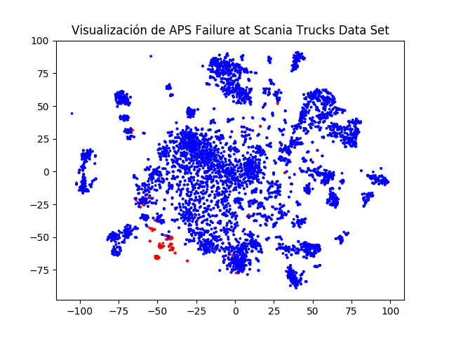
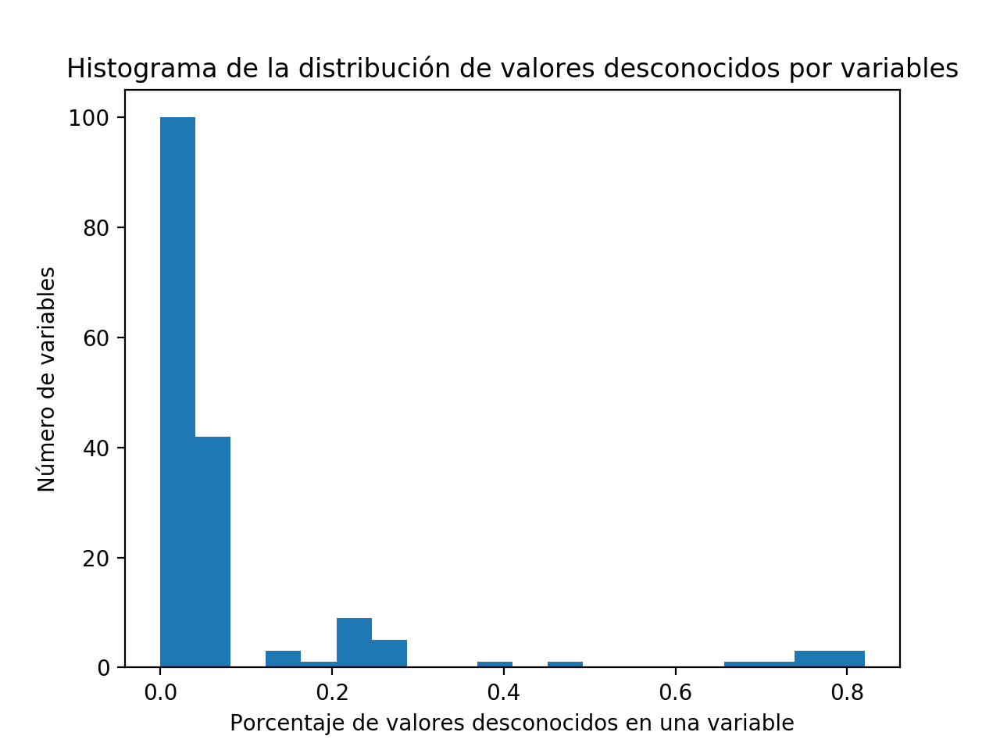
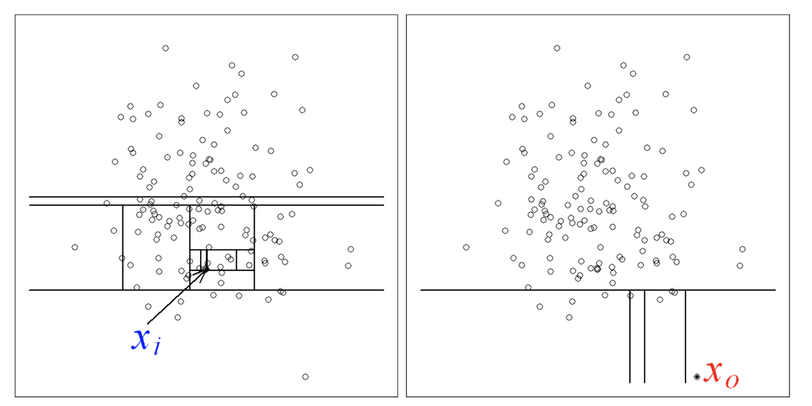
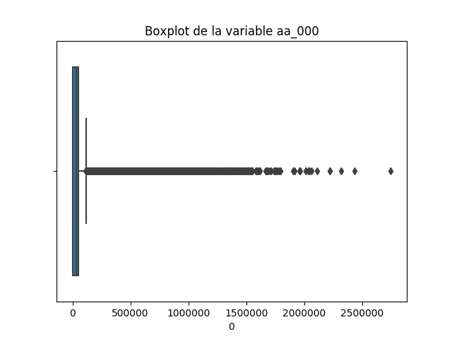
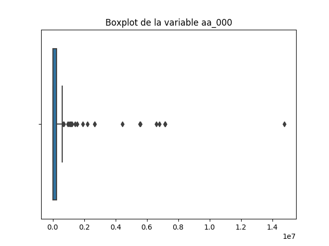
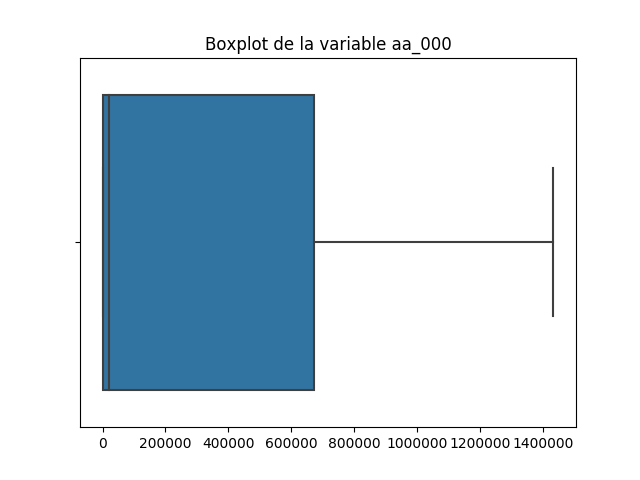
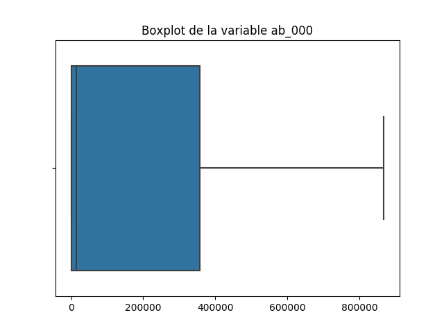

\newpage

# Definición del problema

En este trabajo trataremos el conjunto de datos *APS failure at Scania Trucks*. Este conjunto de datos contiene información sobre el funcionamiento del sistema de presión del aire (*APS*) de camiones Scania, que se encarga de funciones como el frenado.

Se recogen 171 variables seleccionadas por expertos en casos de averías y se asigna a cada dato una clase *positiva* (la avería está relacionada con el APS) o *negativa* (la avería no está relacionada con el APS). El conjunto de entrenamiento proporcionado tiene 60000 ejemplos y el de test tiene 16000.

El problema consiste en predecir la clase de un ejemplo a partir de los atributos, por tanto es un problema de **clasificación**.

Según se especifica en la descripción del conjunto de datos, no todos los errores de clasificación tienen el mismo coste: el coste de los falsos positivos es 50 veces mayor que el de los falsos negativos.

Otra características que cabe señalar es la cantidad de atributos que faltan (al 99% de los datos le falta algún atributo), que toda las variables están anonimizadas por motivos corporativos y que la distribución de clases está muy desbalanceada: solo el 1,7% de los ejemplos del conjunto de entrenamiento pertenecen a la clase positiva.

Trataremos de diseñar un modelo para este problema de cada uno de los siguientes tipos:

* Perceptron;
* Red neuronal;
* Random forest;
* AdaBoost.

Tras el tratamiento de los NaN en el preprocesamiento de datos se puede visualizar un subconjunto de los datos tras su proyección a dos dimensiones con la técnica t-distributed Stochastic Neighbor Embedding. t-SNE es un método para visualización, para reducir la dimensionalidad es preferible usar análisis de componentes principales.
TODO: citar
http://www.jmlr.org/papers/volume9/vandermaaten08a/vandermaaten08a.pdf

{ width=85% }

# Codificación de los datos

## Definición de los conjuntos de training y test

Los conjuntos de training y test vienen ya dados. El conjunto de training consta de 60.000 ejemplos, 59.000 de la clase negativa y 1.000 de la clase positiva. El conjunto de test tiene 16.000 ejemplos.

Para la validación dividiremos el conjunto de training en cinco subconjuntos disjuntos, rotando el subconjunto que se usa como validación y usando los otros cuatro como entrenamiento (validación cruzada).

## Tratamiento de valores desconocidos

El principal problema a resolver en el preprocesado de datos es la cantidad de valores desconocidos en el conjunto.
El 99% de los ejemplos tienen algún valor desconocido, de modo que no es viable eliminar directamente los ejemplos con valores desconocidos.

Es razonable plantearse la posibilidad de eliminar variables con valores desconocidos para la mayoría de ejemplos. Sin embargo, podemos ver en la Figura 1 que la amplia mayoría de variables tienen menos de un 10% de valores desconocidos y ninguna supera el rango de 80% de valores desconocidos. Por tanto eliminar variables supondría sacrificar demasiada información.

{ width=85% }

Optamos por una estrategia de imputación de valores desconocidos.
Esta estrategia consiste en asignar valores donde falten en función del resto de valores del conjunto de datos.

Esto se puede hacer calculando los valores en función de los valores de la misma variable para el resto de ejemplos (imputación univariante) o en función de los valores del resto de variables de ese ejemplo (imputación multivariante).
La imputación univariante se hace con algún estadístico de los valores de cada variable, como la media, la moda o la mediana.

Dado que los algoritmos de imputación multivariante de la librería Scikit Learn están en fase experimental, solo probaremos con la media y la mediana. Usando validación cruzada hemos llegado a la conclusión de que funciona mejor usar la media. TODO: mostrar datos

## Tratamiento de outliers

Los datos a veces pueden tener errores, por ello es deseable hacer un tratamiento previo de los datos problemáticos.
Hay dos tipos principales de análisis de outliers, univariable y multivariable.

Cuando se tratan los outliers en problemas de clasificación hay que tener cuidado, no se deben aplicar directamente las técnicas de detección de outliers sin tener en cuenta la clase de cada elemento.
Si se hace el tratamiento de outliers ignorando la clase en un conjunto muy desbalanceado se corre el riesgo de que la mayoría de elementos de la clase minoritaria sean clasificados como outliers.
En nuestro conjunto de entrenamiento si se aplica una detección de outliers sin considerar la clase obtenemos $2785$ outliers (de un total de $60.000$ elementos), $859$ de ellos tienen clase positiva (de un total de 1.000 casos positivos), estaríamos eliminando la mayoría de elementos de la clase positiva.
Por este motivo es deseable buscar los outliers entre los casos positivos y luego entre los negativos de forma independiente.

TODO: citar justificación separar tratamiento de outliers por clases
https://idus.us.es/xmlui/bitstream/handle/11441/42708/Deletin%20or%20keeping.pdf?sequence=1&isAllowed=y

### Isolation Forest
El algoritmo usado para la detección de outliers es Isolation Forest, que combina diferentes árboles de decisión de profundidad uno para elegir los outliers. En cada etapa del algoritmo se selecciona una característica al azar y un valor aleatorio entre el mínimo y máximo de dicha característica. Este proceso se repite varias etapas, la idea básica es que los outliers en cada variable tendrán valores atípicos, por ello es más probable que queden a un lado de dicho valor elegido al azar. Este proceso se repite varias veces, la identificación de los outliers se basa en que para identificar a un punto que no lo es se necesitará mayor cantidad de particiones.

{ width=85% }
TODO: citar imagen
https://cs.nju.edu.cn/zhouzh/zhouzh.files/publication/icdm08b.pdf

El número de iteraciones es deseable adaptarlo en función del problema, por ejemplo respecto al número de variables del conjunto, usaremos $\{numero de variables\}$ iteraciones para tener un ajuste suficiente para el problema.
Al tener suficientes datos podemos permitirnos que la muestra aleatoria que se usa para entrenar cada árbol sea sin reemplazamiento.
La proporción esperada de outliers está fijada como se especifica en el paper original, alrededor del 10% de los datos.
A continuación se visualiza la evolución de la distribución de valores de una variable.

{ width=50% } { width=50% }

Cada imagen es un diagrama de caja sin tener en cuenta candidatos a outliers si se usase una técnica univariable, posteriormente se han añadido dichos elementos como rombos.
En el primer gráfico se han calculado los candidatos a outliers respecto a una variable, todo esto dentro del conjunto de entrenamiento y con la clase positiva, aplicar detección de outliers sobre el test no tiene sentido.
En la segunda imagen se han eliminado los outliers usando Isolation Forests.
Como se puede comprobar este procedimiento no es equivalente a eliminar variable a variable los elementos que puedan ser outliers usando técnicas univariables. Isolation Forest es una técnica multivariable, combina la información obtenida en todas las variables para decidir los outliers.
Esta aproximación puede aumentar la calidad del conjunto de entrenamiento al eliminar ruido.

# Selección de un subconjunto de variables

## Análisis de componentes principales

Existen diferentes técnicas para reducir la dimensionalidad de los datos. Se podrían eliminar las variables con alta correlación o varianza muy baja.
Otra técnica más adecuada es PCA (Principal Component Analysis), que considera nuevas variables (combinaciones lineales de las originales) no correlacionadas llamadas componentes principales, ordenadas por la cantidad de varianza original que describen.

Posteriormente, se elige el porcentaje de varianza que se quiere poder explicar y se eliminan el máximo número de variables posible que mantenga como mínimo ese porcentaje de varianza explicada, por ello se trata de una técnica de reducción de la dimensionalidad.

La desventaja de este análisis es que de que se pierde interpretabilidad de los datos al optimizar con combinaciones lineales de los mismos. En este caso no nos importa esta desventaja ya que las variables iniciales estaban ya anonimizadas.

Como a priori no sabemos con cuántas variables nos queremos quedar ni si es buena idea reducirlas, probaremos distintos porcentajes de varianza explicada (incluyendo el 100%, que supondría no reducir el número de variables) y se elegirá el mejor por valoración cruzada.

# Normalización de datos

Solamente viendo los diagramas de caja de las dos primeras variables se aprecia que hay diferencias de magnitud en las variables y que sería deseable realizar algún tipo de normalización.

{ width=50% } { width=50% }

Los datos se han normalizado mediante una transformación lineal para que cada variable tenga media nula y desviación estándar 1. El objetivo de esta transformación es que los modelos no estén sesgados hacia dar más peso a determinadas variables. De este modo, dos valores iguales para variables distintas representan valores igual de extremos.

# Función de pérdida

## Selección de clases de funciones

En este problema no tenemos ningún tipo de información acerca del significado de las variables originales, por tanto es imposible saber qué tipo de transformaciones de los datos son *naturales* o razonables.

Se ha aplicado la transformación más simple, una polinómica con grado $2$ y otra con grado $3$. La comparación mediante validación cruzada muestra que los resultados son similares, por ello se elige el menor grado por ser una transformación más simple, ya que es esperable que podrá generalizar mejor.

##  Estimación del error

En el problema se especifica que el objetivo es minimizar el coste, definido como
$$\text{coste\_total} = \text{coste\_fp} \times \text{FP} + \text{coste\_fn} \times \text{FN} \text{,}$$

donde $\text{coste\_fp} = 10$, $\text{coste\_fn} = 500$ y $\text{FP}$ y $\text{FN}$ denotan, respectivamente, el número de datos incorrectamente clasificados por el modelo como positivos y negativos.
Es decir, el coste de un falso negativo (no detectar la verdadera causa de la avería) es mucho mayor que el de un falso positivo (arreglar innecesariamente el APS).

Por tanto, una métrica de la bondad del ajuste tiene que cumplir que su maximización sea equivalente a la minimización de $\text{coste\_total}$. Una posibilidad es usar una tasa de acierto ponderada,

$$\text{tasa\_acierto\_ponderada} = \frac{50 \times \text{VP} + \text{VN}}{50 \times \text{P} + \text{N}} \text{,}$$

donde $P$ y $N$ denotan el número de ejemplos positivos y negativos respectivamente, y $VP$ y $VN$ representan el número de datos correctamente clasificados por el modelo como positivos y negativos.

Podemos comprobar que minimizar $\text{coste\_total}$ es equivalente a maximizar $\text{tasa\_acierto\_ponderada}$. En efecto, maximizar $\text{tasa\_acierto\_ponderada}$ equivale a maximizar su numerador,
$$50 \times \text{VP} + \text{VN} = 50 \times \text{P} - 50 \times \text{FP} + \text{N} - \text{FN}$$
porque su denominador, $50 \times \text{P} + \text{N}$, es constante, y por la misma razón es equivalente a minimizar $50 \times \text{FP} + \text{FN}$, que es obviamente lo mismo que minimizar $\text{coste\_total}$.

La métrica $\text{tasa\_acierto\_ponderada}$ tiene la virtud de estar acotada entre 0, que representa que el coste es el máximo posible, y 1, que representa que el coste es el mínimo posible.

Hay otra métrica usada para problemas con clases muy desbalanceadas llamada curva ROC (Receiver Operating Characteristic). Dado un clasificador se crea una curva que muestra su rendimiento para todos los umbrales de clasificación. Cada punto de dicha curva representa la tasa de falsos positivos en el eje de abscisas y la tasa de falsos negativos en el eje de ordenadas. Posteriormente se calcula el área bajo dicha curva, un área mayor representa mayor robustez del modelo.

La curva ROC es una forma de igualar la importancia de clasificar correctamente cada clase, ya que, de otra forma, clasificar todos los ejemplos con la clase mayoritaria en problemas muy desbalanceados podría considerarse un buen ajuste, y no tiene por qué serlo. Sin embargo, en este problema es preferible usar coste_total ya que se especifica claramente que es la función que se quiere minimizar.

# Selección de la técnica paramétrica

Cada modelo tiene diferentes parámetros que pueden ajustarse para minimizar su error. Por otro lado hay parámetros del preprocesado o procesado de los datos que puede ser deseable que cambien en función del modelo pero no son del propio modelo. Por ejemplo, puede convenir que la agresividad óptima del PCA sea diferente en función del modelo. Estos parámetros, así como los de la regularización que apliquemos al modelo no forman parte estrictamente del modelo pero los trataremos como si lo fuesen desde el punto de vista de su estimación.

Hay parámetros que pueden elegirse mediante el estudio del problema porque está bien establecido su valor óptimo en función de las carácterísticas del problema. Sin embargo, a veces la elección no está tan clara, por ello se puede llevar a cabo la selección de la mejor combinación de parámetros mediante validación cruzada. Una manera de hacerlo es hallar una estimación del error para cada posible combinación de parámetros y elegir la óptima. Sin embargo, a poco que crezca el número de parámetros que queremos ajustar el número de combinaciones se hace intratable.

Para estos casos existen técnicas que estiman el error del modelo para una muestra aleatoria de combinaciones de parámetros y tratan de inferir a partir de esa muestra la combinación que minimiza el error. Esta técnica está implementada en la función `RandomizedSearchCV` de la librería Scikit Learn y es la que usaremos.

# Definición de los modelos y estimación de parámetros

A continuación se muestra una descripción de los modelos y de sus parámetros más importantes. Para la regularización de los modelos también se hace una estimación de parámetros que se comentará posteriormente.

## Perceptron

El algoritmo lineal elegido es el Perceptron. El Percetron es un algoritmo que trata de encontrar un separador lineal de los datos partiendo de un vector inicial de pesos y modificándolo iterativamente para corregir los fallos de clasificación. Por sí mismo no tiene parámetros, pero sí debemos elegir el mejor PCA y los parámetros de la regularización.
Para el PCA obtenemos que lo mejor es aplicar una reducción que explique el $80%$ de la varianza de la muestra original. 

 
## Red neuronal

La combinación de perceptrones permite superar la barrera de los discriminadores lineales.
Una red neuronal consiste en una serie de capas de neuronas, cada una conectada con las capas adyacentes. Al igual que en el perceptrón la primera capa representa la entrada, la última capa la salida y el objetivo último es ajustar los pesos de la red.

El teorema de aproximación universal afirma que una red neuronal con una capa oculta puede aproximar cualquier función continua con entradas dentro de un determinado rango.
En problemas reales puede haber ruido que nos impida una aproximación perfecta, además de otros factores como número de datos insuficiente.

Los elementos más relevantes a la hora de definir una red neuronal son los siguientes:

* Estructura de capas.

    En nuestro problema el número de elementos de la primera capa de entrada viene definido por la dimensionalidad de nuestro problema, por el número de variables que estamos usando. La capa final serán dos elementos, definiendo en cada caso la estimación de la probabilidad de cada salida, positiva o negativa. El número de capas intermedias y de elementos de cada capa no es un parámetro tan fácil de determinar. Por ello se usará una búsqueda paramétrica entre las siguientes distribuciones de capas internas:
    * $(100,)$: una única capa intermedia con $100$ neuronas.
    * $(75, 75)$: dos capas intermedias, cada una con $75$ neuronas.
    * $(20, 20, 20)$: tres capas intermedias, cada una con $20$ neuronas.

* Función de activación.

    En cada perceptrón se aplica una función tras la suma ponderada que nos ayuda a determinar la importancia de dicha neurona en la siguiente capa. La combinación sucesiva de las funciones de activación es lo que otorga la capacidad de aprender funciones no lineales a las redes neuronales. Sin función de activación la salida sería una combinación lineal de las entradas, independientemente del número de capas y su distribución. Las funciones de activación más relevantes que se han considerado son las siguientes:
    * Sigmoide: $f(x)=1/(1+e^{-x})$, es una función no lineal acotada entre $0$ y $1$, existe una generalización para problemas de clasificación múltiple llamada Softmax.
    * Tangente hiperbólica: $f(x) = tanh(x)$, otra función no lineal acotada entre $-1$ y $1$.
    * RELU (Rectifier Linear Unit): $f(x) = \max (0,x)$, al no estar acotada aplica un cambio más agresivo que las dos anteriores con valores altos. Al tener en cuenta solamente los valores positivos puede matar muchas neuronas.

* Ratio de aprendizaje

    Nuestra red aprende con una modificación del gradiente descendiente estocástico
    TODO: citar
    https://arxiv.org/pdf/1412.6980.pdf
    Por ello se necesita un término para definir la velocidad del aprendizaje, no siempre aprender más rápido es mejor.

    * Ratio constantemente igual a $0.001$. Es un ratio pequeño que puede hacer que se requieran más iteraciones para aprender, pero al ser un término pequeño reduce la probabilidad de hacer iteraciones que no nos acerquen a mínimos/máximos.
    * Ratio adaptativo. Al principio del aprendizaje puede ser mejor aprender más rápido y conforme el algoritmo converja reducir dicho ratio para reducir la probabilidad descrita anteriormente.

    
## Boosting
Boosting es un algoritmo que permite combinar algoritmos para obtener mejores resultados.
A cada uno de los algoritmos débiles se le asigna un peso en función de la precisión que tenga, de esta forma mejores algoritmos tendrán más peso en el resultado final, pero no lo determinarán completamente.

El algoritmo planteado es AdaBoost (Adaptive Boosting) una técnica de boosting adaptativa.
La adapción consiste en ir cambiando durante el entrenamiento el peso de los ejemplos, dando mayor importancia a aquellos que fueron clasificados incorrectamente en una iteración.
Una de las críticas principales a este algoritmo es que tiene dificultades para resistir el ruido de la clasificación aleatoria.

Los elementos más relevantes a la hora de definir un clasificador AdaBoost son los siguientes:

* Algoritmo 

    * SAMME (Stagewise Additive Modeling). Modificación del algoritmo AdaBoost que asigna más peso a los puntos mal clasificados.

    * SAMME.R. Variante de SAMME para clasificadores que pueden tener como salida una estimación de las probabilidades. Este algoritmo ajusta los pesos en función de la distancia de dichas probabilidades con el resultado esperado final.
    
    SAMME.R es siempre mejor opción que SAMME, por ello se ha elegido como parámetro 
    TODO: citar
    https://web.stanford.edu/~hastie/Papers/samme.pdf

## Random forest
Random forest es una mejora sobre los árboles de decisión. Se construyen varios árboles de decisión, cada uno usa un subconjunto aleatorio de las variables explicativas para entrenar un arbol sobre un subconjunto aleatorio de datos. Usar diferentes variables para cada árbol ayuda a que los árboles no estén altamente correlados. Los árboles generados tienen ruido, por ello se hace un promedio de los resultados para elegir la salida final, reduciendo la varianza.

Una diferencia con los árboles de decisión es que la clasificación hecha por random forests es difícil de interpretar, pero esto no es un problema en este caso ya que las variables están inicialmente anonimizadas.

Los elementos más relevantes a la hora de definir un clasificador random forest son los siguientes:

* Número de árboles

    Búsqueda del mejor número de árboles dentro del conjunto
    
    * $\{10, 40, 160\}$

* Conjunto de entrenamiento para cada árbol

    Muestra aleatoria con reemplazamiento de igual tamaño al conjunto de datos.

* Criterio para medir la calidad de una ramificación

    Elemento necesario a la hora de entrenar un árbol. 

    * Gini. Hace un cálculo de las impurezas. Para cada rama se mide como $G=\sum_{i=1}^C p(i)(1-p(i))$, donde $C=2$ es el número de clases y $p(i)$ es la probabilidad de que al escoger un elemento al azar en dicha rama sea de la clase i-ésima. Una ramificación perfecta tendría una impureza Gini cero en ambas ramas. Después se calcula una suma ponderada de dichas impurezas en función de la cantidad de elementos de cada rama.

    * Entropía. Criterio para calcula el grado de impredictibilidad de una variable aleatoria. Su fórmula es $Entropy = -\sum_{i=1}^C p(i)\log_2(p(i))$ y se usa para calcular la ganancia de información para cada ramificación, de forma que las mejores ramificaciones se apliquen primero.

    Ambos criterios dan el mismo resultado en la inmensa mayoría de los casos, pero Gini tiene mejor coste computacional, por ello se ha elegido como criterio.
    TODO: citar
    https://www.unine.ch/files/live/sites/imi/files/shared/documents/papers/Gini_index_fulltext.pdf

* Máximo de variables por árbol

    Para generar cada árbol no se eligen todos los predictores ya que si existen predictores muy fuertes entonces los árboles tendrían alta correlación. Se ha usado como valor óptimo la raíz cuadrada del número de variables.
    

# Idoneidad de la regularización

En este apartado se explican los tipos de regularización que se han planteado para cada algoritmo y sus parámetros relevantes.

## Perceptron

* Tipo de regularización

    La idea principal de los tres tipos de regularización es sumar un término a la función de coste que se desea minimizar. Esto ayuda a la generalización del modelo, sea $p$ el número de pesos, $\beta_i$ el peso i-ésimo y $\alpha$ un parámetro a determinar, tenemos tres tipos principales de regularización,

    * L1 (Lasso). En este caso se suma $\alpha\sum_{i=0}^p |\beta_i|$

    * L2 (Ridge). Se suma $\alpha\sum_{i=0}^p \beta_i^2$ a la función de coste.

    * Elasticnet. Combinación de las dos técnicas alteriores, suma $\alpha L_1 + (1-\alpha) L2$.

    El parámetro $\alpha$ se estima mediante validación cruzada dentro del rango $[10^{-5}, 10^{-1}]$.

## Red neuronal

* Alpha

    Parámetro $\alpha$ descrito en el Perceptron, usando regularización L2.

## Boosting

El ratio de aprendizaje se considera un parámetro de regularización en AdaBoost, ya que permite usar más estimadores base sin causar sobreentrenamiento.
TODO: citar
https://pdfs.semanticscholar.org/8055/59b87c0efca148a9ffcd53f5296a51ad3183.pdf

En este caso se han comparado los modelos con ratio de aprendizaje en el intervalo $[10^{-2}, 10^2]$.

## Random forest
Una regularización que se puede hacer a random forest es limitar la altura máxima de cada árbol, de esta forma se minimiza el sobreajuste.
TODO: citar
http://zpascal.net/cvpr2015/Ren_Global_Refinement_of_2015_CVPR_paper.pdf

Los parámetros considerados para la regularización son profundidades dentro del conjunto $\{15,25,50\}$ y la validación cruzada estimará el mejor de dichos parámetros.

# Valoración de los resultados

# Justificación de la calidad del modelo
